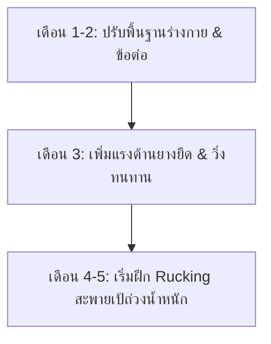

# 🏋️ ตารางออกกำลังกาย 4 วันต่อสัปดาห์ (Workout Plan)
**เป้าหมาย:** สร้างกล้ามเนื้อสไตล์ Athletic ทรง V-Shape + เพิ่มความทนทานแกนกลางและหัวใจเพื่อเตรียมเดินป่า (4-5 เดือนข้างหน้า)

---

## 📅 ภาพรวมตารางเรียนรู้ใน 1 สัปดาห์ (ยืดหยุ่นวันได้)
คุณสามารถเลือกวันออกกำลังกาย 4 วันในหนึ่งสัปดาห์ตามตารางชีวิตของคุณ โดยแนะนำให้มีวันพักแทรกระหว่างวันฝึกหนัก เช่น:
*   **จันทร์:** Day 1: Upper Body Strength
*   **อังคาร:** Day 2: Hiking Conditioning (Cardio & Core)
*   **พุธ:** พัก (Rest)
*   **พฤหัสบดี:** Day 3: Lower Body & Core
*   **ศุกร์:** Day 4: Endurance & Core (Rucking/Tempo)
*   **เสาร์-อาทิตย์:** พัก (Rest) หรือ กิจกรรมเบาๆ (Active Recovery)

### 💡 เทคนิคการจัดตารางเวลาสำหรับคนทำงานออฟฟิศ (ยืดหยุ่น & ปลอดภัย)
เนื่องจากเวลางานของคุณ (เข้า 09:00 AM เลิก 18:00 PM) อาจเลิกช้าหรือเร็วขึ้นอยู่กับสถานการณ์ แนะนำให้ใช้กลยุทธ์ต่อไปนี้:
*   **กลยุทธ์ "วิ่งตามโอกาส" (Flexi-Cardio):** วันธรรมดาวันไหนงานเสร็จไว/เลิกตรงเวลา ให้รีบสลับคิวไปทำ **Day 2 (วิ่ง)** หรือ **Day 4 (เดินเร็ว)** นอกบ้านก่อนเลยทันที เพื่อลดความเสี่ยงที่วันอื่นๆ จะติดงานดึกจนลานวิ่งปิด
*   **กลยุทธ์ "บอดี้เวทตอนเช้า" (Morning Strength):** แนะนำให้ฝึก **Day 1** และ **Day 3 (บอดี้เวทที่บ้าน)** ในช่วงเช้าก่อนไปทำงาน (เช่น 07:00 - 08:00 AM) วิธีนี้จะช่วยรับประกันว่าคุณจะได้ออกกำลังกายครบแน่ๆ โดยไม่ได้รับผลกระทบจากเวลาเลิกงานที่ดึก
*   **สลับวันพักผ่อนอย่างยืดหยุ่น:** วันไหนร่างกายล้าสะสม นอนไม่พอ หรือเจ็บแปล๊บที่ข้อต่อ ให้สลับวันออกกำลังกายไปวันถัดไปทันที การฟื้นฟูร่างกายสำคัญกว่าความเป๊ะของตาราง
*   **ใช้ประโยชน์จากวันหยุด:** เลื่อนคาร์ดิโอนอกบ้าน 1 วันมาลงช่วงเช้าวันเสาร์หรืออาทิตย์ เพื่อผ่อนภาระความเหนื่อยในวันทำงานปกติครับ

---

## 🌅 รูทีนยามเช้าแบบเบาๆ ทำได้ทุกวัน (Daily Morning Active Recovery)
*เพื่อกระตุ้นร่างกายให้ตื่นตัว ยืดเหยียดข้อต่อ และสร้างนิสัย โดยไม่ทำให้กล้ามเนื้อล้า (Greasing the Groove)*

| ท่าออกกำลังกาย | จำนวนเซต x ครั้ง | คำแนะนำ (Golden Rules) |
| :--- | :--- | :--- |
| **1. Bodyweight Squats** | 1 เซต x 10-15 ครั้ง | ทำช้าๆ เน้นยืดเหยียดข้อต่อสะโพกและหัวเข่า |
| **2. Push-ups** | 1 เซต x 5-10 ครั้ง | เน้นยืดกล้ามเนื้อหน้าอกให้เปิดกว้าง |
| **3. Ab Roll** | 1 เซต x 3-5 ครั้ง | กลิ้งไปเท่าที่ควบคุมได้ ห้ามไปสุดจนปวดหลังล่าง |

**🚨 กฎเหล็กสำหรับการทำทุกวัน:**
*   **ห้ามทำจนหมดแรง (Never to failure):** ทำเสร็จต้องรู้สึกชิลๆ เหมือนยังทำต่อได้อีก 10 ครั้ง
*   **ต้องไม่ปวดกล้ามเนื้อ:** ถ้าวันถัดมาปวดตึง แสดงว่าทำหนักไป ให้ลดจำนวนครั้งลง
*   ทำตอนเช้าหลังตื่นนอนหรือก่อนอาบน้ำ ใช้เวลาแค่ 2-3 นาที จะช่วยให้สดชื่นไปทั้งวัน!

---

## 🏃‍♀️ รายละเอียดตารางออกกำลังกายรายวัน

### 🟢 **Day 1: Upper Body Strength & Hypertrophy (กล้ามเนื้อส่วนบน)**
*เน้นสร้างกล้ามเนื้อ อก, หลัง, ไหล่, แขน ด้วยบาร์โหน ยางยืด และบอดี้เวท (ปรับเพิ่มโฟกัส V-Shape)*

**🔥 Dynamic Warm-up (5-10 นาที):** Arm Circles (หมุนหัวไหล่), Band Pull-Aparts (ดึงยางยืด), Cat-Cow Stretch, Walkouts (เดินหนอน), Wrist Rolls (หมุนข้อมือ)

| ท่าออกกำลังกาย (Exercise) | อุปกรณ์ | เซต (Sets) | จำนวนครั้ง (Reps) | พักระหว่างเซต (Rest) | คำแนะนำเพิ่มเติม |
| :--- | :--- | :---: | :---: | :---: | :--- |
| **1. Pull-ups (โหนบาร์)** | บาร์โหน | 3-4 | 6-12 ครั้ง (หรือบวกยางยืดช่วยดึง) | 2 นาที | เน้นดึงข้อและบีบสะบักด้านหลัง (เน้นปีกหลังให้กว้างเพื่อ V-Shape) |
| **2. Seated Band Row** | ยางยืด | 3 | 12-15 ครั้ง | 1 นาที | นั่งดึงยางยืดเข้าหาลำตัว เน้นกล้ามเนื้อปีกและหลัง |
| **3. Resistance Band Overhead Press** | ยางยืด | 3 | 12-15 ครั้ง | 1.5 นาที | ยืนเหยียบสายยางยืด ดันมือขึ้นเหนือศีรษะ (หน้าไหล่/ไหล่รวม) |
| **4. Single-Arm Banded Lateral Raise** | ยางยืด | 3 | 15-20 ครั้ง/ข้าง | 1 นาที | กางแขนด้านข้างทีละข้าง (เน้นไหล่ข้างให้กว้างคือหัวใจของ V-Shape) |
| **5. Banded Barbell Curl** | ยางยืด (หรือบาร์เบล) | 3 | 12-15 ครั้ง | 1 นาที | ม้วนแขนดึงยางยืดหรือบาร์เบล (เน้นกล้ามเนื้อหน้าแขน Biceps) |
| **6. Chair Dip** | เก้าอี้ | 3 | 10-15 ครั้ง | 1 นาที | ดันตัวขึ้นลงที่ขอบเก้าอี้ (เน้นกล้ามเนื้อหลังแขน Triceps) |
| **7. Decline Push-ups** | ร่างกายตัวเอง + เก้าอี้ | 3 | 10-15 ครั้ง | 1.5 นาที | วางเท้าบนเก้าอี้เพื่อเน้นหน้าอกส่วนบน |

---

### 🔵 **Day 2: Hiking Conditioning (Cardio & Core) (ความอึดและแกนกลาง)**
*เน้นความอึดของระบบไหลเวียนโลหิตและเพิ่มความแข็งแรงของแกนกลาง ป้องกันอาการปวดหลังเวลาเดินป่า (ควบคุมเวลาการฝึกทั้งหมดให้อยู่ใน 60 นาที)*

**🔥 Dynamic Warm-up (5-10 นาที):** Ankle Rolls (หมุนข้อเท้า), Leg Swings (เตะขาสลับ), High Knees & Butt Kicks, Bird-Dog (ท่าหมานก)

1.  **Jump Rope (กระโดดเชือก):**
    *   กระโดด 1 นาที สลับพัก 30 วินาที ทำทั้งหมด **5-8 รอบ** (~7-12 นาที) เพื่อฝึกน่อง/ข้อเท้าและวอร์มอัพร่างกาย
2.  **Zone 2 Running (วิ่งควบคุมชีพจร):**
    *   วิ่งจ็อกกิ้งเบาๆ ความเหนื่อยระดับ Zone 2 เป็นเวลา **30 นาที** (เน้นสร้างความทนทานระบบแอโรบิก)
3.  **Core Routine (แกนกลางลำตัว):** (ทำ 2 เซตเพื่อควบคุมเวลาให้อยู่ใน ~10-15 นาที)
    *   **Ab Wheel (ลูกกลิ้งหน้าท้อง):** 2 เซต เซตละ 8-12 ครั้ง (เน้นเกร็งท้อง ไม่ให้หลังแอ่น)
    *   **Hanging Knee Raises (โหนบาร์ยกเข่า):** 2 เซต เซตละ 10-12 ครั้ง (ฝึกแกนกลางส่วนล่างและแรงจับของมือ)
    *   **Plank:** 2 เซต เซตละ 45-60 วินาที

---

### 🟡 **Day 3: Lower Body & Core (กล้ามเนื้อส่วนล่างและแกนกลาง)**
*สร้างฐานรากที่แข็งแกร่งสำหรับการปีนเขา ลุยทางชัน และพยุงน้ำหนักตัว (ใช้เวลาประมาณ 45-50 นาที)*

**🔥 Dynamic Warm-up (5-10 นาที):** Bodyweight Squats (สควอทตัวเปล่า), Glute Bridges (สะพานโค้งยกสะโพก), Hip Openers (เปิดหน้าขา), World's Greatest Stretch, Lunges with a Twist

| ท่าออกกำลังกาย (Exercise) | อุปกรณ์ | เซต (Sets) | จำนวนครั้ง (Reps) | พักระหว่างเซต (Rest) | คำแนะนำเพิ่มเติม |
| :--- | :--- | :---: | :---: | :---: | :--- |
| **1. Goblet Squat (Banded)** | ยางยืด | 4 | 15-20 ครั้ง | 1.5 นาที | คล้องยางยืดใต้ฝ่าเท้าและอ้อมผ่านบ่า ย่อตัวลงลึก |
| **2. Bulgarian Split Squat** | ร่างกายตัวเอง + เก้าอี้ | 3 | 10-12 ครั้ง/ข้าง | 1.5 นาที | วางเท้าข้างหนึ่งไว้บนเก้าอี้ด้านหลัง แล้วย่อขาลง |
| **3. Banded Romanian Deadlift** | ยางยืด | 3 | 15-20 ครั้ง | 1 นาที | เน้นพับสะโพกตึงต้นขาด้านหลังและก้น (ลดแรงกระแทกเข่า) |
| **4. Calf Raises (เขย่งปลายเท้า)** | ร่างกายตัวเอง/บันได | 4 | 20-25 ครั้ง | 1 นาที | ยืนปลายเท้าบนขอบบันได กดส้นลงต่ำแล้วเขย่งขึ้นสุด |
| **5. Ab Wheel (ลูกกลิ้งหน้าท้อง)** | ลูกกลิ้ง | 3 | 8-12 ครั้ง | 1 นาที | ยืดตัวไปข้างหน้าช้าๆ แล้วดึงกลับด้วยแรงท้อง |
| **6. Russian Twists (Banded)** | ยางยืด/ตัวเปล่า | 3 | 20 ครั้ง (ข้างละ 10) | 1 นาที | ฝึกกล้ามเนื้อท้องด้านข้าง (ใช้ตัวเปล่า/ยางยืดเบาๆ เลี่ยงน้ำหนักมากเพื่อไม่ให้เอวหนา) |

---

### 🔴 **Day 4: Endurance & Core (คาร์ดิโอสร้างความอึด / Rucking ช่วง 2 เดือนสุดท้าย)**
*ฝึกความทนทานแกนกลางและหัวใจ (ควบคุมเวลาการฝึกทั้งหมดให้อยู่ใน 60 นาที)*

**🔥 Dynamic Warm-up (5-10 นาที):** Shoulder Rolls (หมุนหัวไหล่), Torso Twists (บิดลำตัว), Dynamic Calf Stretches (ยืดน่องแบบขยับ), High Steps (ย่ำเท้าอยู่กับที่)

1.  **Cardio Walk / Rucking (เดินเร็วตัวเปล่า หรือสะพายเป้ถ่วงน้ำหนัก):** (เน้นคุมเวลา 40-45 นาที)
    *   **สัปดาห์ที่ 1-12 (เดือนที่ 1-3):** เดินเร็วตัวเปล่า (หรือวิ่งเหยาะๆ) ระยะเวลา **40-45 นาที** (ประมาณ 4 กิโลเมตร) เพื่อฝึกความทนทานของปอด หัวใจ และข้อต่อโดยไม่มีน้ำหนักกดทับ
    *   **สัปดาห์ที่ 13 เป็นต้นไป (เดือนที่ 4-5):** เริ่มฝึกสะพายเป้ถ่วงน้ำหนัก (Rucking) เริ่มต้นใส่เป้ 3 กิโลกรัม เดินเร็วคุมเวลา 45 นาที และค่อยๆ เพิ่มน้ำหนักขึ้นสัปดาห์ละ 1 กิโลกรัม (สูงสุดไม่เกิน 6-8 กิโลกรัม หรือน้ำหนักเป้จริงของคุณ)
2.  **Core & Lower Back (แกนกลางและหลังส่วนล่าง):** (ทำ 2 เซต เพื่อให้อยู่ในเวลา ~10 นาที)
    *   **Superman Hold (นอนคว่ำยกแขนและขาขึ้น):** 2 เซต เซตละ 30 วินาที (เสริมความแข็งแรงของหลังส่วนล่างที่ต้องรับเป้)
    *   **Resistance Band Pallof Press:** 2 เซต เซตละ 12 ครั้ง/ข้าง (ฝึกต้านการหมุนตัว เพิ่มเสถียรภาพสะโพกและหลัง)
    *   **Plank:** 2 เซต เซตละ 60 วินาที

---

## 📈 แผนการพัฒนาความยากใน 4-5 เดือน (Progressive Overload Timeline)

*   **เดือนที่ 1-2 (ปรับสภาพร่างกาย):** ฝึกฟอร์มการออกกำลังกายให้ถูกต้อง วิ่ง Zone 2 และเดินเร็วตัวเปล่าเพื่อสร้างหัวใจ ปอด และระบบเส้นเอ็นข้อต่อให้แข็งแรงโดยไม่มีแรงกดทับ
*   **เดือนที่ 3 (เพิ่มแรงต้าน):** เพิ่มความท้าทายด้วยยางยืดที่แรงต้านมากขึ้น เน้นเพิ่มระดับความเร็วในการวิ่งและจำนวนรอบกระโดดเชือก
*   **เดือนที่ 4-5 (ฝึกสะพายเป้จริง - 2 เดือนสุดท้ายก่อนเดินทาง):** เริ่มฝึกสะพายเป้ถ่วงน้ำหนัก (Rucking) ในวัน Day 4 เริ่มต้นที่ 3 กก. ไต่ระดับสัปดาห์ละ 1 กก. ไปจนถึง 6-8 กก. เพื่อความคุ้นเคยกับการรับแรงของหลังและแกนกลาง
