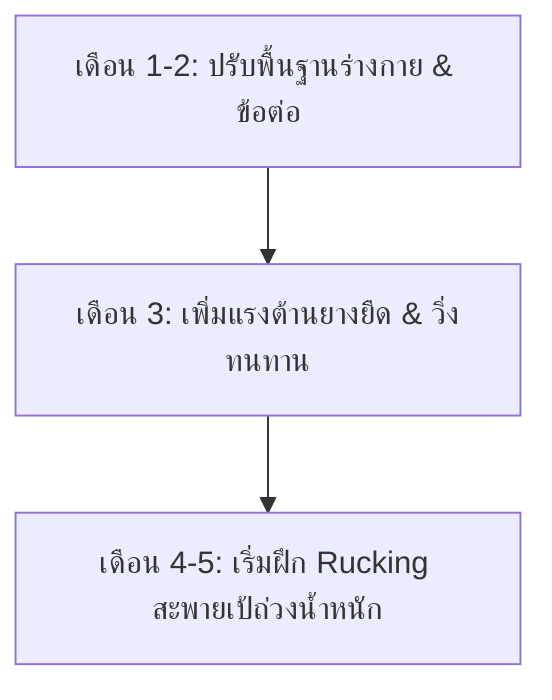

# 🏋️ ตารางออกกำลังกาย 4 วันต่อสัปดาห์ (Workout Plan)
**เป้าหมาย:** สร้างกล้ามเนื้อสไตล์ Athletic ทรง V-Shape + เพิ่มความทนทานแกนกลางและหัวใจเพื่อเตรียมเดินป่า (4-5 เดือนข้างหน้า)

---

## 📅 ภาพรวมตารางเรียนรู้ใน 1 สัปดาห์ (ยืดหยุ่นวันได้)
คุณสามารถเลือกวันออกกำลังกาย 4 วันในหนึ่งสัปดาห์ตามตารางชีวิตของคุณ โดยแนะนำให้มีวันพักแทรกระหว่างวันฝึกหนัก เช่น:
*   **จันทร์:** Day 1: Upper Body Strength
*   **อังคาร:** Day 2: Hiking Conditioning (Cardio & Core)
*   **พุธ:** พัก (Rest)
*   **พฤหัสบดี:** Day 3: Lower Body & Core
*   **ศุกร์:** Day 4: Endurance & Core (Rucking/Tempo)
*   **เสาร์-อาทิตย์:** พัก (Rest) หรือ กิจกรรมเบาๆ (Active Recovery)

### 💡 เทคนิคการจัดตารางเวลาสำหรับคนทำงานออฟฟิศ (ยืดหยุ่น & ปลอดภัย)
เนื่องจากเวลางานของคุณ (เข้า 09:00 AM เลิก 18:00 PM) อาจเลิกช้าหรือเร็วขึ้นอยู่กับสถานการณ์ แนะนำให้ใช้กลยุทธ์ต่อไปนี้:
*   **กลยุทธ์ "วิ่งตามโอกาส" (Flexi-Cardio):** วันธรรมดาวันไหนงานเสร็จไว/เลิกตรงเวลา ให้รีบสลับคิวไปทำ **Day 2 (วิ่ง)** หรือ **Day 4 (เดินเร็ว)** นอกบ้านก่อนเลยทันที เพื่อลดความเสี่ยงที่วันอื่นๆ จะติดงานดึกจนลานวิ่งปิด
*   **กลยุทธ์ "บอดี้เวทตอนเช้า" (Morning Strength):** แนะนำให้ฝึก **Day 1** และ **Day 3 (บอดี้เวทที่บ้าน)** ในช่วงเช้าก่อนไปทำงาน (เช่น 07:00 - 08:00 AM) วิธีนี้จะช่วยรับประกันว่าคุณจะได้ออกกำลังกายครบแน่ๆ โดยไม่ได้รับผลกระทบจากเวลาเลิกงานที่ดึก
*   **สลับวันพักผ่อนอย่างยืดหยุ่น:** วันไหนร่างกายล้าสะสม นอนไม่พอ หรือเจ็บแปล๊บที่ข้อต่อ ให้สลับวันออกกำลังกายไปวันถัดไปทันที การฟื้นฟูร่างกายสำคัญกว่าความเป๊ะของตาราง
*   **ใช้ประโยชน์จากวันหยุด:** เลื่อนคาร์ดิโอนอกบ้าน 1 วันมาลงช่วงเช้าวันเสาร์หรืออาทิตย์ เพื่อผ่อนภาระความเหนื่อยในวันทำงานปกติครับ

---

## 🌅 รูทีนเบาๆ ทำได้ทุกวัน หรือหลังซ้อมวิ่ง (Daily Active Recovery)
*เพื่อกระตุ้นร่างกายให้ตื่นตัว ยืดเหยียดข้อต่อ และฝึกระบบประสาทกล้ามเนื้อโดยไม่ทำให้ล้าสะสม (Greasing the Groove)*
*(แนะนำให้พักเต็มที่ในวันพุธเพื่อการฟื้นฟูร่างกายแบบ 100% เว้นแต่ว่าวันพุธนั้นจะรู้สึกกระปรี้กระเปร่าและอยากยืดเหยียดจริงๆ)*

| ท่าออกกำลังกาย | จำนวนเซต x ครั้ง | คำแนะนำ (Golden Rules) |
| :--- | :--- | :--- |
| **1. Bodyweight Squats** | 1-2 เซต x 10-15 ครั้ง | ทำช้าๆ เน้นยืดข้อต่อสะโพก เข่า และข้อเท้า |
| **2. Push-ups** | 1-2 เซต x 5-10 ครั้ง | เน้นฟอร์มที่ถูกต้อง ดันอกและเปิดหัวไหล่ |
| **3. Pull-ups / Chin-ups** | 1-2 เซต x 1-2 ครั้ง | ทำจำนวนครั้งน้อยมากๆ แค่โหนตัวขึ้นสบายๆ ไม่ให้หมดแรง |
| **4. Ab Wheel (ลูกกลิ้งหน้าท้อง)** | 1 เซต x 3-5 ครั้ง | กลิ้งไปเท่าที่เกร็งท้องควบคุมได้ ห้ามไปลึกจนปวดหลังล่าง |

**🚨 กฎเหล็กสำหรับการฝึกรูปแบบนี้:**
*   **ห้ามทำจนหมดแรง (Never to failure):** ทำเสร็จแล้วต้องรู้สึกชิลๆ เหมือนยังทำต่อได้อีกหลายครั้ง (เช่น ถ้าปกติดึงข้อได้ 4 ครั้ง ให้ทำแค่ 1-2 ครั้งพอค่ะ)
*   **ต้องไม่ปวดตึงกล้ามเนื้อ:** หากวันรุ่งขึ้นมีอาการปวดกล้ามเนื้อ (DOMS) แสดงว่าทำจำนวนครั้งเยอะเกินไป ให้ลดจำนวนครั้งลงทันทีค่ะ
*   **สามารถทำตอนเช้าหลังตื่นนอน หรือทำเป็นคูลดาวน์ (Cooldown) หลังจากกลับมาจากวิ่งได้ทันทีค่ะ** เนื่องจากร่างกายได้รับการวอร์มอัพเต็มที่อยู่แล้ว การทำท่าเหล่านี้เบาๆ จะช่วยส่งเลือดไปเลี้ยงกล้ามเนื้อและช่วยฟื้นฟูร่างกายได้ดีมากค่ะ
*   **วันพุธเป็นวันพักผ่อน (Rest Day):** แนะนำให้ปล่อยร่างกายสบายๆ ไม่ต้องออกกำลังกายใดๆ เพื่อให้กล้ามเนื้อและข้อต่อได้ฟื้นฟูเต็มที่ แต่หากวันพุธไหนรู้สึกพลังงานล้นเหลือและอยากทำยืดเหยียดเบาๆ ก็สามารถทำรูทีนนี้ได้ค่ะตามความรู้สึกของร่างกาย (Autoregulation)

---

## 🏃‍♀️ รายละเอียดตารางออกกำลังกายรายวัน

### 🟢 **Day 1: Upper Body Strength & Hypertrophy (กล้ามเนื้อส่วนบน)**
*เน้นสร้างกล้ามเนื้อ อก, หลัง, ไหล่, แขน ด้วยบอดี้เวทและบาร์โหน (เรียบง่าย ไม่ต้องใช้อุปกรณ์เสริมเพื่อ V-Shape)*

**🔥 Dynamic Warm-up (5-10 นาที):** Arm Circles (หมุนหัวไหล่), Neck Rolls (หมุนคอ), Cat-Cow Stretch, Walkouts (เดินหนอน), Wrist Rolls (หมุนข้อมือ)

| ท่าออกกำลังกาย (Exercise) | อุปกรณ์ | เซต (Sets) | จำนวนครั้ง (Reps) | พักระหว่างเซต (Rest) | คำแนะนำเพิ่มเติม |
| :--- | :--- | :---: | :---: | :---: | :--- |
| **1. Wide-Grip Pull-ups (ดึงข้อมือคว่ำจับกว้าง)** | บาร์โหน | 3-4 | 4-8 ครั้ง (หรือตามแรงไหว) | 2 นาที | จับกว้างกว่าหัวไหล่เล็กน้อย เน้นดึงและบีบสะบักหลัง (เน้นสร้างความกว้างปีก V-Shape) |
| **2. Regular Push-ups (วิดพื้นธรรมดา)** | ร่างกายตัวเอง | 3-4 | 10-15 ครั้ง | 1.5 นาที | วางมือความกว้างระดับหัวไหล่ เน้นอก หน้าไหล่ และหลังแขน |
| **3. Close-Grip Chin-ups (ดึงข้อมือหงายจับชิด)** | บาร์โหน | 3 | 4-8 ครั้ง | 2 นาที | หงายมือจับบาร์ระยะชิดกัน เน้นดึงขึ้น (สร้างกล้ามเนื้อหน้าแขน Biceps และปีกส่วนล่าง) |
| **4. Diamond Push-ups (วิดพื้นมือชิด)** | ร่างกายตัวเอง | 3 | 6-12 ครั้ง | 1.5 นาที | วางมือชิดกันเป็นรูปเพชร (เน้นกล้ามเนื้อหลังแขน Triceps และอกส่วนใน) |
| **5. Pike Push-ups (วิดพื้นตัววี)** | ร่างกายตัวเอง | 3 | 6-12 ครั้ง | 1.5 นาที | โก่งสะโพกขึ้นเลียนแบบรูปตัว V คว่ำแล้วกดหัวลง (เน้นกล้ามเนื้อหัวไหล่ทดแทนการยกน้ำหนัก) |

---

### 🔵 **Day 2: Hiking Conditioning (Cardio & Core) (ความอึดและแกนกลาง)**
*เน้นความอึดของระบบไหลเวียนโลหิตและเพิ่มความแข็งแรงของแกนกลาง ป้องกันอาการปวดหลังเวลาเดินป่า (ควบคุมเวลาการฝึกทั้งหมดให้อยู่ใน 60 นาที)*

**🔥 Dynamic Warm-up (5-10 นาที):** Ankle Rolls (หมุนข้อเท้า), Leg Swings (เตะขาสลับ), High Knees & Butt Kicks, Bird-Dog (ท่าหมานก)

1.  **Jump Rope (กระโดดเชือก):**
    *   กระโดด 1 นาที สลับพัก 30 วินาที ทำทั้งหมด **5-8 รอบ** (~7-12 นาที) เพื่อฝึกน่อง/ข้อเท้าและวอร์มอัพร่างกาย
2.  **Zone 2 Running (วิ่งควบคุมชีพจร):**
    *   วิ่งจ็อกกิ้งเบาๆ ความเหนื่อยระดับ Zone 2 เป็นเวลา **30 นาที** (เน้นสร้างความทนทานระบบแอโรบิก)
3.  **Core Routine (แกนกลางลำตัว):** (ทำ 2 เซตเพื่อควบคุมเวลาให้อยู่ใน ~10-15 นาที)
    *   **Ab Wheel (ลูกกลิ้งหน้าท้อง):** 2 เซต เซตละ 8-12 ครั้ง (เน้นเกร็งท้อง ไม่ให้หลังแอ่น)
    *   **Hanging Knee Raises (โหนบาร์ยกเข่า):** 2 เซต เซตละ 10-12 ครั้ง (ฝึกแกนกลางส่วนล่างและแรงจับของมือ)
    *   **Plank:** 2 เซต เซตละ 45-60 วินาที

---

### 🟡 **Day 3: Lower Body & Core (กล้ามเนื้อส่วนล่างและแกนกลาง)**
*สร้างฐานรากที่แข็งแกร่งสำหรับการปีนเขา ลุยทางชัน และพยุงน้ำหนักตัวด้วยบอดี้เวทล้วน*

**🔥 Dynamic Warm-up (5-10 นาที):** Bodyweight Squats (สควอทตัวเปล่า), Glute Bridges (สะพานโค้งยกสะโพก), Hip Openers (เปิดหน้าขา), World's Greatest Stretch, Lunges with a Twist

| ท่าออกกำลังกาย (Exercise) | อุปกรณ์ | เซต (Sets) | จำนวนครั้ง (Reps) | พักระหว่างเซต (Rest) | คำแนะนำเพิ่มเติม |
| :--- | :--- | :---: | :---: | :---: | :--- |
| **1. Bodyweight Squats (สควอทตัวเปล่า)** | ร่างกายตัวเอง | 4 | 15-20 ครั้ง | 1.5 นาที | ย่อตัวลงลึกช้าๆ เน้นยืดเหยียดสะโพกและต้นขา (สามารถเพิ่มความยากโดยทำ Tempo ช้าๆ ได้) |
| **2. Forward Lunges (ก้าวขาแล้วย่อ)** | ร่างกายตัวเอง | 3 | 10-12 ครั้ง/ข้าง | 1.5 นาที | ก้าวเท้าไปข้างหน้าแล้วย่อตัวตรง (ฝึกแรงขาและจำลองเสถียรภาพการก้าวขึ้นทางชัน) |
| **3. Single-Leg Romanian Deadlift** | ร่างกายตัวเอง | 3 | 10-12 ครั้ง/ข้าง | 1.5 นาที | ยืนขาเดียวยกขาอีกข้างไปข้างหลังพร้อมก้มตัว (ฝึกความแข็งแรงหลังขา ก้น และการทรงตัวของข้อเท้า) |
| **4. Calf Raises (เขย่งปลายเท้า)** | ร่างกายตัวเอง/บันได | 4 | 20-25 ครั้ง | 1 นาที | เขย่งส้นเท้าขึ้นสุดลงสุด (สร้างความแข็งแรงของน่องและข้อเท้าเพื่อเตรียมปีนเขาชัน) |
| **5. Ab Wheel หรือ Plank** | ลูกกลิ้ง / ตัวเปล่า | 3 | 8-12 ครั้ง (หรือแพลงก์ 60 วินาที) | 1 นาที | กลิ้งตัวไปข้างหน้า หรือทำแพลงก์ธรรมดาเพื่อฝึกเกร็งแกนกลางต้านการบาดเจ็บหลัง |

---

### 🔴 **Day 4: Endurance & Core (คาร์ดิโอสร้างความอึด / Rucking ช่วง 2 เดือนสุดท้าย)**
*ฝึกความทนทานแกนกลางและหัวใจ (ควบคุมเวลาการฝึกทั้งหมดให้อยู่ใน 60 นาที)*

**🔥 Dynamic Warm-up (5-10 นาที):** Shoulder Rolls (หมุนหัวไหล่), Torso Twists (บิดลำตัว), Dynamic Calf Stretches (ยืดน่องแบบขยับ), High Steps (ย่ำเท้าอยู่กับที่)

1.  **Cardio Walk / Rucking (เดินเร็วตัวเปล่า หรือสะพายเป้ถ่วงน้ำหนัก):** (เน้นคุมเวลา 40-45 นาที)
    *   **สัปดาห์ที่ 1-12 (เดือนที่ 1-3):** เดินเร็วตัวเปล่า (หรือวิ่งเหยาะๆ) ระยะเวลา **40-45 นาที** (ประมาณ 4 กิโลเมตร) เพื่อฝึกความทนทานของปอด หัวใจ และข้อต่อโดยไม่มีน้ำหนักกดทับ
    *   **สัปดาห์ที่ 13 เป็นต้นไป (เดือนที่ 4-5):** เริ่มฝึกสะพายเป้ถ่วงน้ำหนัก (Rucking) เริ่มต้นใส่เป้ 3 กิโลกรัม เดินเร็วคุมเวลา 45 นาที และค่อยๆ เพิ่มน้ำหนักขึ้นสัปดาห์ละ 1 กิโลกรัม (สูงสุดไม่เกิน 6-8 กิโลกรัม หรือน้ำหนักเป้จริงของคุณ)
2.  **Core & Lower Back (แกนกลางและหลังส่วนล่าง):** (ทำ 2 เซต เพื่อให้อยู่ในเวลา ~10 นาที)
    *   **Superman Hold (นอนคว่ำยกแขนและขาขึ้น):** 2 เซต เซตละ 30 วินาที (เสริมความแข็งแรงของหลังส่วนล่างที่ต้องรับเป้)
    *   **Side Plank (แพลงก์ข้าง):** 2 เซต เซตละ 30-45 วินาที/ข้าง (ฝึกต้านการเอียงตัว เพิ่มความทนทานแกนกลางลำตัวด้านข้าง)
    *   **Plank:** 2 เซต เซตละ 60 วินาที

---

## 📈 แผนการพัฒนาความยากใน 4-5 เดือน (Progressive Overload Timeline)

*   **เดือนที่ 1-2 (ปรับสภาพร่างกาย):** ฝึกฟอร์มการออกกำลังกายให้ถูกต้อง วิ่ง Zone 2 และเดินเร็วตัวเปล่าเพื่อสร้างหัวใจ ปอด และระบบเส้นเอ็นข้อต่อให้แข็งแรงโดยไม่มีแรงกดทับ
*   **เดือนที่ 3 (เพิ่มแรงต้าน):** เพิ่มความท้าทายด้วยยางยืดที่แรงต้านมากขึ้น เน้นเพิ่มระดับความเร็วในการวิ่งและจำนวนรอบกระโดดเชือก
*   **เดือนที่ 4-5 (ฝึกสะพายเป้จริง - 2 เดือนสุดท้ายก่อนเดินทาง):** เริ่มฝึกสะพายเป้ถ่วงน้ำหนัก (Rucking) ในวัน Day 4 เริ่มต้นที่ 3 กก. ไต่ระดับสัปดาห์ละ 1 กก. ไปจนถึง 6-8 กก. เพื่อความคุ้นเคยกับการรับแรงของหลังและแกนกลาง
