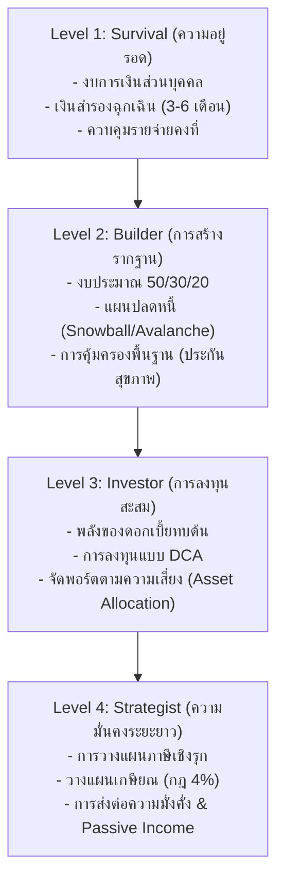

# 📈 แผนที่นำทางการเงินและการลงทุน (Wealth Roadmap)

แผนภาพและแผนงานแบบเป็นขั้นตอนในการพัฒนาทักษะการเงิน ตั้งแต่ระดับพื้นฐานไปจนถึงระดับสูงที่สามารถสร้างระบบการเงินที่อัตโนมัติและพึ่งพาตนเองได้

---

## 🗺️ แผนการเงิน 4 ระดับ (The 4 Financial Levels)

---

## 🛠️ รายละเอียดแผนปฏิบัติการในแต่ละระดับ (Action Plan)

### 🔴 Level 1: Survival (การเอาชีวิตรอดทางการเงิน)
*จุดประสงค์: หยุดการรั่วไหลของเงินและสร้างเบาะรองรับยามวิกฤต*

1.  **จัดทำงบการเงินส่วนบุคคล (Personal Financial Statement):** 
    *   จดบันทึกรายรับ-รายจ่ายทุกวันเป็นเวลาอย่างน้อย 1 เดือน
    *   คำนวณ **ความมั่งคั่งสุทธิ (Net Worth)** = *สินทรัพย์รวม - หนี้สินรวม*
2.  **สร้างเงินสำรองฉุกเฉิน (Emergency Fund):**
    *   กันเงินสดสะสมไว้ในบัญชีออมทรัพย์ดอกเบี้ยสูง (e-Savings) เท่ากับ **3 ถึง 6 เท่าของค่าใช้จ่ายรายเดือน**
    *   ห้ามนำเงินส่วนนี้ไปใช้จ่ายอย่างอื่นเด็ดขาด เว้นแต่เกิดเหตุฉุกเฉินจริง (เช่น เจ็บป่วย, ตกงาน, ซ่อมบ้าน/รถ)
3.  **ควบคุมอัตราหนี้สินต่อรายได้ (Debt-to-Income Ratio):**
    *   ควบคุมให้หนี้บริโภค (เช่น หนี้บัตรเครดิต, หนี้ผ่อนของ) มีอัตราต่ำกว่า 20% ของรายได้

---

### 🟡 Level 2: Builder (การสร้างรากฐานความมั่งคั่ง)
*จุดประสงค์: ปรับโครงสร้างเงิน สร้างวินัยการออม และขจัดหนี้เสีย*

1.  **จัดสรรเงินด้วยสูตร 50/30/20 (The 50/30/20 Budgeting Rule):**
    *   **50% Needs (ความจำเป็น):** ค่าบ้าน, ค่ารถ, ค่าน้ำไฟ, อาหารหลัก, หนี้สินขั้นต่ำ
    *   **30% Wants (ความต้องการส่วนตัว):** กินข้าวนอกบ้าน, ท่องเที่ยว, ช้อปปิ้ง, ความบันเทิง
    *   **20% Savings & Debt Repayment (การออมและการลงทุน):** สะสมเงินออม, ลงทุนเพิ่ม, จ่ายเงินโปะหนี้เพิ่ม
2.  **แผนบริหารหนี้สิน (Debt Management Plans):**
    *   **Debt Snowball:** เรียงหนี้จากยอดน้อยที่สุดไปมากที่สุด จ่ายขั้นต่ำทุกตัวแล้วเอาเงินเหลือโปะตัวน้อยสุดให้หมดเพื่อสร้างกำลังใจ
    *   **Debt Avalanche:** เรียงหนี้จากอัตราดอกเบี้ยแพงสุดไปถูกสุด โปะตัวที่ดอกเบี้ยแพงที่สุดก่อนเพื่อประหยัดเงินดอกเบี้ยให้ได้มากที่สุด
3.  **เริ่มจัดการความเสี่ยงพื้นฐาน:**
    *   มีประกันสุขภาพหรือประกันอุบัติเหตุเบื้องต้น เพื่อไม่ให้ปัญหาสุขภาพย้อนกลับมาทำลายเงินออมทั้งหมด

---

### 🟢 Level 3: Investor (การลงทุนสะสมความมั่งคั่ง)
*จุดประสงค์: ให้เงินทำงานแทนและเอาชนะเงินเฟ้อด้วยการลงทุน*

1.  **สะสมด้วยวิธี DCA (Dollar-Cost Averaging):**
    *   ตั้งระบบลงทุนอัตโนมัติทุกเดือนในกองทุนดัชนี (เช่น ดัชนีหุ้นไทย SET50, ดัชนีหุ้นโลก ACWI หรือดัชนีสหรัฐ S&P 500)
    *   ฝึกวินัยในการลงทุนระยะยาวโดยไม่ต้องสนใจความผันผวนระยะสั้นของตลาด
2.  **การกระจายความเสี่ยงและการจัดพอร์ตสินทรัพย์ (Asset Allocation):**
    *   กระจายน้ำหนักตามความสามารถในการรับความเสี่ยงและอายุ:
        *   **พอร์ตเติบโตสูง (Aggressive):** หุ้น 80% | ตราสารหนี้ 15% | สินทรัพย์ทางเลือก (ทองคำ/อสังหาฯ) 5%
        *   **พอร์ตปานกลาง (Balanced):** หุ้น 50% | ตราสารหนี้ 40% | ทองคำ 10%
        *   **พอร์ตระมัดระวัง (Conservative):** หุ้น 20% | ตราสารหนี้ 70% | เงินสด/ทองคำ 10%

---

### 🔵 Level 4: Strategist (การวางแผนการเงินขั้นสูง)
*จุดประสงค์: รักษาความมั่งคั่งให้ยั่งยืน วางแผนเกษียณ และใช้ชีวิตอย่างอิสระ*

1.  **การวางแผนและประหยัดภาษี (Tax Optimization):**
    *   ศึกษาเกณฑ์ภาษีเงินได้บุคคลธรรมดาและใช้สิทธิ์ลดหย่อนภาษีอย่างเต็มที่ เช่น กองทุนลดหย่อนภาษี (SSF/RMF/ThaiESG), ประกันชีวิต, ประกันบำนาญ
2.  **การวางแผนเพื่อการเกษียณ (Retirement Planning):**
    *   คำนวณเป้าหมายเงินกองทุนเกษียณอายุด้วย **กฎ 4% (The 4% Rule)**
3.  **การสร้างแหล่งรายได้ที่หลากหลาย:**
    *   สร้างระบบสร้างเงิน เช่น ค่าเช่าอสังหาริมทรัพย์, ลิขสิทธิ์ทางปัญญา, ปันผลจากพอร์ตหุ้น และธุรกิจที่ทำงานด้วยระบบอัตโนมัติ

---

## 🧮 สูตรทางการเงินที่สำคัญ (Key Financial Formulas)

*   **ความมั่งคั่งสุทธิ (Net Worth)**
    $$\text{Net Worth} = \text{Total Assets} - \text{Total Liabilities}$$
*   **อัตราส่วนเงินออม (Savings Rate)**
    $$\text{Savings Rate} = \left( \frac{\text{Monthly Savings}}{\text{Gross Income}} \right) \times 100\%$$
*   **กฎเลข 72 (Rule of 72) - คาดการณ์เวลาที่เงินจะเติบโตเป็น 2 เท่า**
    $$\text{จำนวนปีที่เงินจะเติบโตเป็น 2 เท่า} \approx \frac{72}{\text{ผลตอบแทนการลงทุนต่อปี (\%)}}$$
    *(เช่น ถ้าได้รับผลตอบแทน 6% ต่อปี เงินจะเบิ้ลเป็น 2 เท่าในระยะเวลาประมาณ $72 \div 6 = 12$ ปี)*
*   **คำนวณเงินกองทุนเกษียณตามกฎ 4% (Retirement Target)**
    $$\text{ยอดเงินกองทุนที่ต้องเตรียมเพื่อเกษียณ} = \text{ค่าใช้จ่ายรายปีหลังเกษียณ} \times 25$$
    *(เช่น คาดว่าจะใช้เงินปีละ 300,000 บาทหลังเกษียณ จะต้องมีเงินตั้งต้นที่เกษียณ $300,000 \times 25 = 7,500,000$ บาท เพื่อที่จะสามารถถอนเงินออกมาใช้ได้ปีละ 4% โดยที่เงินต้นยังมีโอกาสเติบโตชนะเงินเฟ้อ)*

---
> [!TIP]
> ลองเริ่มบันทึกรายรับรายจ่ายวันนี้ และคำนวณหา "ความมั่งคั่งสุทธิ" ของตนเองดูเป็นขั้นตอนแรก หากต้องการคำนวณหรือเปรียบเทียบแผนทางการเงินใดๆ สอบถามผมให้ช่วยคำนวณได้ทันทีครับ!
